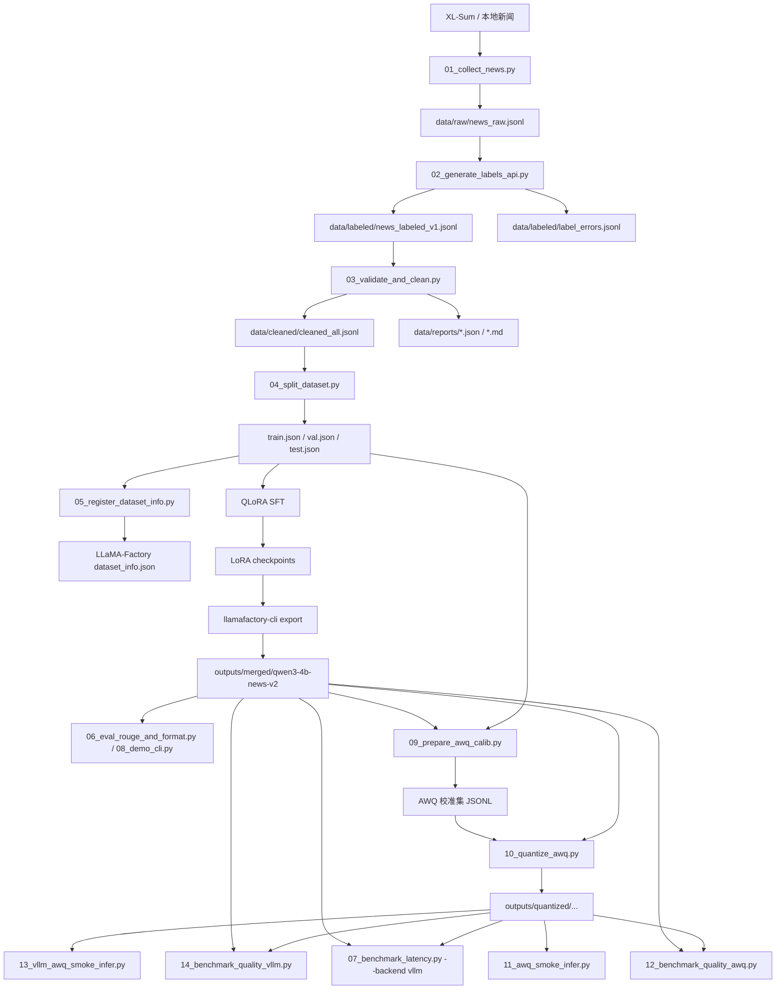
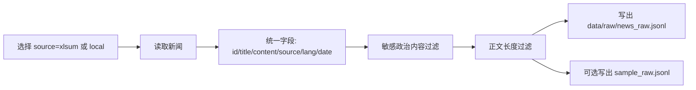
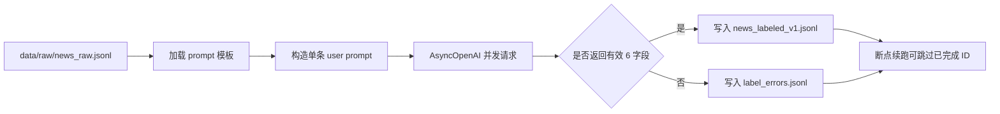
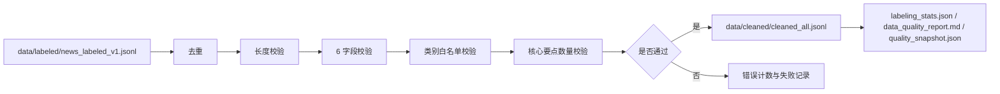
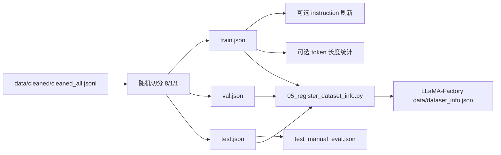
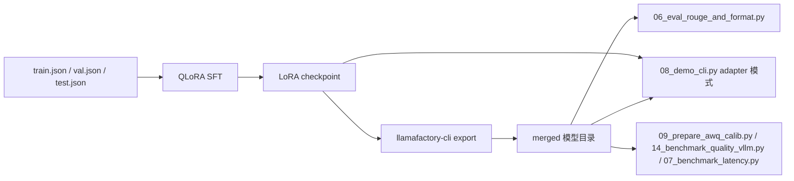
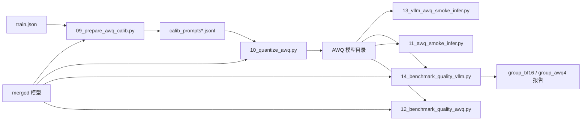
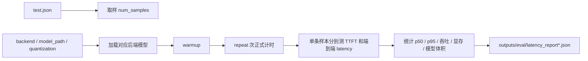

# 端侧新闻结构化摘要系统架构说明

## 目录

- [1 项目概述](#1-项目概述)
- [2 整体架构总览](#2-整体架构总览)
- [3 数据集构建](#3-数据集构建)
  - [3.1 模块设计目标](#31-模块设计目标)
  - [3.2 数据采集：01_collect_news.py](#32-数据采集01_collect_newspy)
  - [3.3 API 标注：02_generate_labels_api.py](#33-api-标注02_generate_labels_apipy)
  - [3.4 校验清洗：03_validate_and_clean.py](#34-校验清洗03_validate_and_cleanpy)
  - [3.5 数据切分与注册：04_split_dataset.py / 05_register_dataset_info.py](#35-数据切分与注册04_split_datasetpy--05_register_dataset_infopy)
- [4 SFT](#4-sft)
  - [4.1 设计目标](#41-设计目标)
  - [4.2 组件组成](#42-组件组成)
  - [4.3 核心流程](#43-核心流程)
  - [4.4 关键参数](#44-关键参数)
  - [4.5 推理与评测职责矩阵](#45-推理与评测职责矩阵)
  - [4.6 设计取舍](#46-设计取舍)
- [5 AWQ](#5-awq)
  - [5.1 设计目标](#51-设计目标)
  - [5.2 组件组成](#52-组件组成)
  - [5.3 核心流程](#53-核心流程)
  - [5.4 关键参数](#54-关键参数)
  - [5.5 状态传递与持久化](#55-状态传递与持久化)
  - [5.6 设计取舍](#56-设计取舍)
- [6 性能评测](#6-性能评测)
  - [6.1 设计目标](#61-设计目标)
  - [6.2 组件组成](#62-组件组成)
  - [6.3 核心流程](#63-核心流程)
  - [6.4 指标口径](#64-指标口径)
  - [6.5 后端能力对比](#65-后端能力对比)
  - [6.6 关键参数](#66-关键参数)
  - [6.7 设计取舍](#67-设计取舍)

## 1 项目概述

本项目的当前实现目标，是将输入新闻文本转换为固定 6 字段的结构化摘要，并形成一条从数据集构建、QLoRA SFT、LoRA 权重合并、AWQ 后训练量化，到质量与性能评测的闭环工程链路。

固定输出协议如下：

```text
【一句话摘要】
【核心要点】
【事件类别】
【主要主体】
【时间信息】
【潜在影响】
```

当前资料能够确认的主链路如下：

```text
01_collect_news
 -> 02_generate_labels_api
 -> 03_validate_and_clean
 -> 04_split_dataset
 -> 05_register_dataset_info
 -> LLaMA-Factory train / export
 -> 09_prepare_awq_calib
 -> 10_quantize_awq
 -> 13_vllm_awq_smoke_infer
 -> 14_benchmark_quality_vllm
 -> 07_benchmark_latency --backend vllm
```

当前资料能够确认的备选链路如下：

```text
10_quantize_awq
 -> 11_awq_smoke_infer
 -> 12_benchmark_quality_awq
```

备选链路的用途是 AutoAWQ 推理兼容与排障，不是主结论口径。

### 1.1 已实现边界

| 类型 | 当前已确认实现 | 说明 |
|------|----------------|------|
| 数据构建 | 是 | 已实现新闻采集、API 标注、清洗、切分与注册 |
| SFT 训练 | 是 | 已提供 QLoRA 训练配置，训练入口依赖 LLaMA-Factory |
| LoRA 导出 merged 模型 | 是 | 当前资料通过 `llamafactory-cli export` 完成，仓库未单独封装导出脚本 |
| AWQ 量化 | 是 | 已实现校准集准备、AutoAWQ 量化、量化报告输出 |
| 质量评测 | 是 | 已实现 BF16 / AWQ 质量对比，统一复用格式与 ROUGE 口径 |
| 性能评测 | 是 | 已实现 HF / AutoAWQ / vLLM 三后端延迟评测 |
| CLI 演示 | 是 | 已实现单模型与 base-vs-SFT 对比模式 |
| 在线服务接口 | 未在当前代码中确认 | 仓库内未看到 Web API、服务编排或在线请求路由 |
| 多轮对话记忆 | 未在当前代码中确认 | 当前输入为单轮 `system + user` 任务提示，不是多轮会话系统 |
| 自动化调度平台 | 未在当前代码中确认 | 当前流程由脚本与命令手动串联 |

## 2 整体架构总览

### 2.1 模块地图

| 模块 | 主要目录 / 文件 | 解决的问题 | 核心输入 | 核心输出 | 关键协作对象 |
|------|------------------|------------|----------|----------|--------------|
| 数据采集与标注 | `scripts/01_collect_news.py` `scripts/02_generate_labels_api.py` | 将原始新闻转成结构化监督样本 | XL-Sum 或本地新闻文件 | `data/raw/news_raw.jsonl` `data/labeled/news_labeled_v1.jsonl` | HuggingFace Datasets、OpenAI 兼容 API |
| 数据清洗与切分 | `scripts/03_validate_and_clean.py` `scripts/04_split_dataset.py` `scripts/05_register_dataset_info.py` | 保证样本协议稳定，并注册到训练框架 | 标注后的 JSONL | `train.json` `val.json` `test.json` `dataset_info.json` 追加项 | LLaMA-Factory |
| SFT 训练与导出 | `configs/train_qwen3_4b_qlora_news_v2.yaml` `configs/train_qwen3_8b_qlora_news.yaml` | 让基座模型学习 6 字段结构化任务 | 训练集与训练配置 | LoRA checkpoint、merged 模型目录 | LLaMA-Factory、Qwen3-4B / 8B |
| SFT 评测与演示 | `scripts/06_eval_rouge_and_format.py` `scripts/08_demo_cli.py` `configs/infer_news*.yaml` | 评估与展示 base / SFT 的输出质量与格式稳定性 | 测试集、模型路径、adapter / merged 模型 | 预测文件、ROUGE 报告、格式报告、Demo 输出 | transformers、peft |
| AWQ 校准与量化 | `scripts/09_prepare_awq_calib.py` `scripts/10_quantize_awq.py` | 将 merged 模型压缩为 AWQ 模型 | `train.json`、merged 模型 | 校准集 JSONL、AWQ 模型目录、量化报告 | AutoAWQ、transformers |
| AWQ 质量评测 | `scripts/13_vllm_awq_smoke_infer.py` `scripts/14_benchmark_quality_vllm.py` `scripts/11_awq_smoke_infer.py` `scripts/12_benchmark_quality_awq.py` | 验证量化模型可加载、可生成、质量变化可量化 | 测试集、BF16 merged 模型、AWQ 模型 | 冒烟报告、全量质量对比报告、checkpoint | vLLM、AutoAWQ |
| 性能评测 | `scripts/07_benchmark_latency.py` | 测试加载耗时、TTFT、端到端延迟、吞吐、磁盘体积与显存 | 测试集、模型路径、后端参数 | `latency_report*.json` | HF、AutoAWQ、vLLM、NVML / nvidia-smi |

### 2.2 总流程图



### 2.3 状态传递表

| 状态 / 产物 | 产生阶段 | 读入阶段 | 持久化位置 | 生命周期说明 |
|-------------|----------|----------|------------|--------------|
| 原始新闻样本 | 数据采集 | API 标注 | `data/raw/news_raw.jsonl` | 采集后的统一原始输入 |
| 采样预览文件 | 数据采集 | 人工抽查 | `data/raw/sample_raw.jsonl` | 仅用于预览，不参与主链 |
| 标注结果 | API 标注 | 清洗校验 | `data/labeled/news_labeled_v1.jsonl` | 结构化监督样本的原始版本 |
| 标注错误日志 | API 标注 | 人工排查 | `data/labeled/label_errors.jsonl` | 记录 API 失败与格式不合法样本 |
| 清洗后总集 | 清洗校验 | 数据切分 | `data/cleaned/cleaned_all.jsonl` | 已去重、已校验的训练候选集 |
| 训练 / 验证 / 测试集 | 数据切分 | 训练、评测、量化 | `data/cleaned/train.json` `val.json` `test.json` | 主数据入口 |
| 手工评测子集 | 数据切分 | 人工检查 | `data/cleaned/test_manual_eval.json` | 当前代码只负责抽样，不负责自动评分 |
| 数据集注册信息 | 数据注册 | LLaMA-Factory 训练 / 推理 | `LLaMA-Factory/data/dataset_info.json` | 通过追加方式注入 |
| LoRA checkpoint | SFT 训练 | 导出 / Demo / 对比 | `outputs/checkpoints/...` | 参数高效微调产物 |
| merged 模型目录 | LoRA 导出 | AWQ、BF16 评测、性能评测 | `outputs/merged/qwen3-4b-news-v2` | SFT 主对照模型与 AWQ 输入 |
| AWQ 校准集 | 校准准备 | AWQ 量化 | `outputs/awq/*.jsonl` | 当前推荐为 chat-template + 分层抽样 |
| AWQ 模型目录 | AWQ 量化 | 冒烟、质量、性能评测 | `outputs/quantized/...` | 量化后的部署候选模型 |
| 推理 checkpoint | 质量评测 | 同一脚本重启后恢复 | `group_*/infer_checkpoint.jsonl` | 每条样本即时写盘 |
| 评测报告 | 质量 / 性能评测 | README 汇总、人工分析 | `outputs/eval/*.json` | 统一统计输出 |
| tokenizer 修复目录 | vLLM / latency 脚本运行时 | 同轮推理 | `*_tokenizerfix` 目录 | 兼容 `extra_special_tokens` 结构 |

### 2.4 主路径、兼容路径与兜底逻辑

| 决策点 | 主路径 | fallback / 兼容逻辑 | 当前说明 |
|--------|--------|----------------------|----------|
| 推理后端 | vLLM | AutoAWQ 后端 | README 和脚本组织都把 vLLM 设为主链 |
| AWQ 冒烟 | `13_vllm_awq_smoke_infer.py` | `11_awq_smoke_infer.py` | 前者用于主口径，后者用于兼容排障 |
| AWQ 质量评测 | `14_benchmark_quality_vllm.py` | `12_benchmark_quality_awq.py` | 前者支持 checkpoint 与 BF16/AWQ 串行对照 |
| thinking 模式 | 关闭 | Base 历史对照保留 `enable_thinking=true` | 当前结构化任务主策略是不思考模板 |
| tokenizer 兼容 | 原模型 tokenizer | 运行时生成 `*_tokenizerfix` | 用于 vLLM / transformers 对 `extra_special_tokens` 的兼容修复 |
| AWQ 量化版本 | GEMM | 失败时回退 GEMV | 由 `10_quantize_awq.py` 在异常时自动切换 |
| SFT 模型加载 | 直接加载 merged 模型 | `base + adapter -> merge_and_unload` | `06_eval_rouge_and_format.py` 中的 SFT 加载优先顺序 |

## 3 数据集构建

### 3.1 模块设计目标

- 把新闻摘要任务转成稳定的单轮监督学习样本。
- 在训练前把结构错误、类别错误、样本重复和长度异常尽量前移清理。
- 让训练、评测、量化三条链路共享同一套数据划分与提示约束。
- 把数据持久化到可追溯文件，而不是只保存在内存中。

### 3.2 数据采集：01_collect_news.py

#### 3.2.1 设计目标

- 提供统一原始新闻输入格式。
- 支持 XL-Sum 与本地 JSON / JSONL 两种来源。
- 在进入标注前完成长度过滤与政治敏感内容过滤。
- 对中英新闻使用统一输出结构，便于后续统一中文标注。

#### 3.2.2 组件组成

| 组件 | 所在目录 / 文件 | 主要职责 | 上游输入 | 下游输出 |
|------|------------------|----------|----------|----------|
| 采集入口 | `scripts/01_collect_news.py` | 解析参数并统一执行采集流程 | CLI 参数 | 原始新闻文件 |
| XL-Sum 采集器 | 同文件 `collect_from_xlsum` / `collect_from_xlsum_mixed` | 从 HuggingFace parquet 数据中读取中英新闻 | `csebuetnlp/xlsum` | 统一新闻记录列表 |
| 本地采集器 | 同文件 `collect_from_local` | 从本地 JSON / JSONL 导入新闻 | 本地文件 | 统一新闻记录列表 |
| 敏感过滤器 | 同文件 `is_political` | 过滤政治敏感新闻 | 标题 + 正文 | 保留 / 丢弃 |
| 长度过滤器 | 同文件 `filter_records` | 过滤过短或过长正文 | 新闻记录列表 | 过滤后的记录 |
| 持久化器 | 同文件 `save_records` `save_sample` | 写出原始数据与预览数据 | 记录列表 | `news_raw.jsonl` `sample_raw.jsonl` |

#### 3.2.3 核心流程



#### 3.2.4 阶段表

| 阶段 | 关键组件 | 输入 | 输出 | 说明 |
|------|----------|------|------|------|
| 数据读取 | `collect_from_xlsum` / `collect_from_local` | XL-Sum parquet 或本地文件 | 统一新闻记录 | XL-Sum 默认采用中英混合 |
| 内容过滤 | `is_political` `filter_records` | 新闻记录列表 | 过滤后记录 | 先过滤政治敏感内容，再按长度过滤 |
| 预览与写盘 | `save_records` `save_sample` | 过滤后记录 | JSONL 文件 | 输出文件位于 `data/raw/` |

#### 3.2.5 关键参数

| 参数名 | 中文解释 | 当前值 / 默认值 | 生效位置 | 设置原因 / 设计取舍 |
|--------|----------|-----------------|----------|----------------------|
| `--source` | 数据来源 | `xlsum` | `01_collect_news.py` | 默认使用公开数据集复现主链路 |
| `--lang` | 语言选择 | `mixed` | `01_collect_news.py` | 默认中英各半，统一由后续 API 转成中文结构化摘要 |
| `--max_samples` | 最大采样数 | `5000` | `01_collect_news.py` | 控制原始数据规模 |
| `--min_content_len` | 最小正文长度 | `100` | `01_collect_news.py` | 过滤过短新闻，减少无效样本 |
| `--max_content_len` | 最大正文长度 | `8000` | `01_collect_news.py` | 避免极长正文进入后续标注与训练 |
| `--preview` | 是否打印预览 | 默认关闭 | `01_collect_news.py` | 用于本地检查样本质量 |
| `--no_sample` | 是否关闭预览文件写出 | 默认关闭 | `01_collect_news.py` | 预览文件不是主链必需产物 |

#### 3.2.6 设计取舍

| 决策点 | 当前方案 | 替代方案 | 当前为什么这样做 |
|--------|----------|----------|------------------|
| 数据源 | XL-Sum 为默认，local 为补充 | 只支持一种来源 | 兼顾主链复现与本地自定义数据导入 |
| 语言策略 | 中英混合统一转中文标签 | 只做中文 | 扩大样本来源，同时保持最终输出协议统一 |
| 过滤时机 | 采集阶段先做政治敏感与长度过滤 | 到标注后再清洗 | 前移过滤可减少 API 成本和异常样本比例 |
| 输出格式 | 统一 JSONL 记录 | 保持原数据集原生格式 | 后续脚本可以无差别消费 |

### 3.3 API 标注：02_generate_labels_api.py

#### 3.3.1 设计目标

- 将原始新闻自动转换为监督训练样本。
- 保证输出协议是固定 6 字段结构。
- 通过并发、断点续跑和重试降低大批量标注的失败成本。
- 把失败样本与成功样本分别持久化，便于复盘。

#### 3.3.2 组件组成

| 组件 | 所在目录 / 文件 | 主要职责 | 上游输入 | 下游输出 |
|------|------------------|----------|----------|----------|
| 提示模板加载器 | `scripts/02_generate_labels_api.py` `data/prompts/label_prompt_news_structured.txt` | 读取新闻结构化标注模板 | 模板文件 | prompt 字符串 |
| API 调用器 | 同文件 `call_api_async` | 发送异步对话请求到 OpenAI 兼容接口 | model、messages | 标注结果文本 |
| 并发控制器 | 同文件 `process_records_async` | 控制并发、文件锁、进度统计 | 原始新闻记录 | 标注结果与错误日志 |
| 断点续跑器 | 同文件 `load_done_ids` | 从已有输出中恢复已完成样本 | 已输出 JSONL | 需要继续处理的 ID 集合 |
| 初步格式校验器 | 同文件 `validate_label` | 检查是否包含全部 6 个字段 | 标注文本 | 通过 / 失败 |
| 持久化器 | 同文件输出逻辑 | 写入成功样本与错误样本 | 标注结果 | `news_labeled_v1.jsonl` `label_errors.jsonl` |

#### 3.3.3 核心流程



#### 3.3.4 阶段表

| 阶段 | 关键组件 | 输入 | 输出 | 说明 |
|------|----------|------|------|------|
| 模板装载 | `load_prompt_template` | 模板文件或内置兜底模板 | prompt 模板 | 标题与正文会填入模板 |
| 请求构造 | `process_records_async` | 原始新闻记录 | `messages=[{"role":"user",...}]` | 当前实现是单轮 user 消息，不含多轮上下文 |
| API 调用 | `call_api_async` | model、messages | 原始标注文本 | 对异常做指数退避重试 |
| 初步验证 | `validate_label` | 标注文本 | 是否包含 6 字段 | 只做字段存在检查，不做类别和要点数检查 |
| 结果持久化 | 输出逻辑 | 校验结果 | 成功 / 失败 JSONL | 成功样本会生成 `instruction/input/output` 结构 |

#### 3.3.5 关键参数

| 参数名 | 中文解释 | 当前值 / 默认值 | 生效位置 | 设置原因 / 设计取舍 |
|--------|----------|-----------------|----------|----------------------|
| `OPENAI_API_KEY` | API 密钥 | 环境变量 | `02_generate_labels_api.py` | 不写死在仓库中 |
| `OPENAI_API_BASE` | API Base URL | 默认 `https://api.openai.com/v1` | `02_generate_labels_api.py` | 兼容 OpenAI 风格服务 |
| `OPENAI_MODEL` | 调用模型 | 默认 `gpt-4o-mini`，README 示例使用 `deepseek-chat` | `02_generate_labels_api.py` | 当前实现允许通过环境变量替换 |
| `--concurrency` | 并发请求数 | `5` | `02_generate_labels_api.py` | 控制 API 吞吐与稳定性 |
| `--max_retries` | 重试次数 | `3` | `02_generate_labels_api.py` | 兼顾成功率与成本 |
| `temperature` | 生成温度 | `0.1` | `call_api_async` | 保持输出较稳定但不过度死板 |
| `max_tokens` | 最大输出 token | `800` | `call_api_async` | 覆盖结构化摘要长度 |
| `content_truncated` | 输入正文截断长度 | `3000` 字符 | `process_records_async` | 控制请求长度与 API 成本 |
| `--resume` | 是否断点续跑 | 默认开启 | `02_generate_labels_api.py` | 避免重复标注已完成样本 |

#### 3.3.6 设计取舍

| 决策点 | 当前方案 | 替代方案 | 当前为什么这样做 |
|--------|----------|----------|------------------|
| 请求形态 | 单轮 `user` 消息 | system + user 双消息 | 模板本身已经包含完整任务约束，当前实现更直接 |
| 校验粒度 | 先只校验 6 字段是否出现 | 在此处就做完整严格清洗 | 让标注阶段尽量快速，详细规则留给 03 脚本统一处理 |
| 失败处理 | 写错误日志并继续 | 整批任务遇错中断 | 保证大规模标注任务可持续推进 |
| 恢复方式 | 根据已输出 ID 跳过 | 每次从头重跑 | 降低长任务中断成本 |

### 3.4 校验清洗：03_validate_and_clean.py

#### 3.4.1 设计目标

- 把“字段存在”升级为“可训练”的严格样本。
- 清理类别越界、要点数不足、长度异常和重复样本。
- 输出可读报告和质量快照，而不是只输出最终数据。
- 将清洗逻辑集中，避免训练前分散修补。

#### 3.4.2 组件组成

| 组件 | 所在目录 / 文件 | 主要职责 | 上游输入 | 下游输出 |
|------|------------------|----------|----------|----------|
| 字段校验器 | `scripts/03_validate_and_clean.py` `check_sections` | 检查 6 字段是否完整 | 标注文本 | 缺失字段列表 |
| 类别提取与校验器 | 同文件 `extract_category` `check_category` | 校验类别是否命中白名单 | 标注文本 | 合法 / 不合法 |
| 要点校验器 | 同文件 `check_bullet_points` | 检查要点编号与数量 | 标注文本 | 要点数与通过状态 |
| 去重器 | 同文件 `deduplicate` | 按 `instruction + input` 去重 | 记录列表 | 唯一记录列表 |
| 单条验证器 | 同文件 `validate_record` | 汇总长度、字段、类别、要点的校验结果 | 标注记录 | 通过 / 错误列表 |
| 快照与报告器 | 同文件 `summarize_quality` `generate_report` | 输出统计 JSON 与 Markdown 报告 | 通过样本 / 错误分布 | 报告文件 |

#### 3.4.3 核心流程



#### 3.4.4 阶段表

| 阶段 | 关键组件 | 输入 | 输出 | 说明 |
|------|----------|------|------|------|
| 去重 | `deduplicate` | 标注记录列表 | 唯一记录 | 使用透明字符串键，而不是 `hash()` |
| 基础校验 | `validate_record` | 单条标注记录 | 错误列表 | 包括长度、字段、类别、要点数 |
| 清洗输出 | 主流程列表推导 | 通过样本 | `cleaned_all.jsonl` | 输出只保留 `instruction/input/output` |
| 统计报告 | `generate_report` `summarize_quality` | 通过样本与错误统计 | JSON / Markdown 报告 | 保留数据分布和抽样预览 |

#### 3.4.5 关键参数

| 参数名 | 中文解释 | 当前值 / 默认值 | 生效位置 | 设置原因 / 设计取舍 |
|--------|----------|-----------------|----------|----------------------|
| `--strict` | 是否严格校验类别白名单 | 默认关闭 | `03_validate_and_clean.py` | 允许在非严格模式下接受部分组合类别 |
| `--min_input_len` | 输入最短长度 | `50` | `03_validate_and_clean.py` | 过滤明显无效输入 |
| `--max_input_len` | 输入最长长度 | `4000` | `03_validate_and_clean.py` | 控制训练可用长度范围 |
| `--min_output_len` | 输出最短长度 | `100` | `03_validate_and_clean.py` | 避免过短摘要进入训练 |
| `--max_output_len` | 输出最长长度 | `2000` | `03_validate_and_clean.py` | 控制异常长输出 |
| `VALID_CATEGORIES` | 类别白名单 | 中英类别集合 | `03_validate_and_clean.py` | 兼容中英标签混出 |
| `sample_preview_count` | 快照抽样条数 | `3` | `03_validate_and_clean.py` | 便于快速人工抽查 |
| `seed` | 随机种子 | `42` | `03_validate_and_clean.py` | 保证快照抽样可复现 |

#### 3.4.6 设计取舍

| 决策点 | 当前方案 | 替代方案 | 当前为什么这样做 |
|--------|----------|----------|------------------|
| 去重键 | `instruction + input` 字符串键 | 使用 `hash()` | 当前实现明确规避哈希碰撞风险 |
| 类别校验 | 支持非严格模式 | 永远严格过滤 | 降低误杀率，把严格模式作为可选参数 |
| 清洗输出字段 | 只保留训练所需三元组 | 保留所有原始元数据 | 让训练文件保持最小必要结构 |
| 报告形式 | 同时输出 JSON 和 Markdown | 只输出机器可读结果 | 兼顾程序消费与人工审阅 |

### 3.5 数据切分与注册：04_split_dataset.py / 05_register_dataset_info.py

#### 3.5.1 设计目标

- 生成 train / val / test 三个稳定数据切分。
- 可选统一刷新 instruction，避免训练提示词不一致。
- 可选按 chat template 统计 token 长度，辅助判断 `cutoff_len`。
- 将数据集注册到 LLaMA-Factory，接入训练与推理配置。

#### 3.5.2 组件组成

| 组件 | 所在目录 / 文件 | 主要职责 | 上游输入 | 下游输出 |
|------|------------------|----------|----------|----------|
| 数据切分器 | `scripts/04_split_dataset.py` `split_dataset` | 按比例切分训练 / 验证 / 测试集 | `cleaned_all.jsonl` | `train.json` `val.json` `test.json` |
| instruction 刷新器 | 同文件 `refresh_instruction` | 用统一文本覆盖 instruction 字段 | 记录列表 | 更新后的记录 |
| token 分析器 | 同文件 `analyze_token_lengths` | 按 chat template 统计训练样本 token 分布 | `train.json` 与 tokenizer | `token_length_report.json` |
| 注册器 | `scripts/05_register_dataset_info.py` | 追加数据集定义到 `dataset_info.json` | train/val/test 路径 | LLaMA-Factory 数据集配置 |
| 根目录定位器 | 同文件 `find_llamafactory_root` | 自动定位 LLaMA-Factory 根目录 | 当前路径 / 项目路径 | LLaMA-Factory 根目录 |

#### 3.5.3 核心流程



#### 3.5.4 阶段表

| 阶段 | 关键组件 | 输入 | 输出 | 说明 |
|------|----------|------|------|------|
| 随机切分 | `split_dataset` | `cleaned_all.jsonl` | train/val/test 列表 | 使用固定随机种子 |
| instruction 统一 | `refresh_instruction` | train/val/test | 刷新后的数据集 | 默认不启用，按需执行 |
| 手工评测抽样 | 主流程抽样逻辑 | test 集 | `test_manual_eval.json` | 当前默认抽样 100 条 |
| token 分析 | `analyze_token_lengths` | train 集与 tokenizer | token 长度报告 | 用于辅助解释 `cutoff_len` |
| 数据集注册 | `register_datasets` | train/val/test 路径 | `dataset_info.json` 追加项 | 采用 append，不覆盖已有配置 |

#### 3.5.5 关键参数

| 参数名 | 中文解释 | 当前值 / 默认值 | 生效位置 | 设置原因 / 设计取舍 |
|--------|----------|-----------------|----------|----------------------|
| `train_ratio` | 训练集比例 | `0.8` | `04_split_dataset.py` | 与 README 主链一致 |
| `val_ratio` | 验证集比例 | `0.1` | `04_split_dataset.py` | 与 README 主链一致 |
| `test_ratio` | 测试集比例 | `0.1` | `04_split_dataset.py` | 与 README 主链一致 |
| `seed` | 随机种子 | `42` | `04_split_dataset.py` | 保证切分稳定 |
| `manual_eval_count` | 手工评测样本数 | `100` | `04_split_dataset.py` | 便于额外人工核查 |
| `refresh_instruction` | 是否统一 instruction | 默认关闭 | `04_split_dataset.py` | 作为可选数据修正工具 |
| `MEDIUM_SYSTEM_PROMPT` | 中等约束系统提示词 | 内置常量 | `04_split_dataset.py` | 用于 token 统计与后续主口径统一 |
| `cutoff_len` | 训练截断长度参考 | `1024` | `04_split_dataset.py` | 用于分析超长样本比例 |
| `find_llamafactory_root` | 自动定位深度 | 最多向上查找 8 层 | `05_register_dataset_info.py` | 降低手动指定路径成本 |

#### 3.5.6 设计取舍

| 决策点 | 当前方案 | 替代方案 | 当前为什么这样做 |
|--------|----------|----------|------------------|
| 切分策略 | 固定随机切分 | 分层切分 | 当前代码未做类别分层，优先保持流程简单可复现 |
| instruction 管理 | 提供统一刷新开关 | 直接在清洗阶段硬编码覆盖 | 把修正能力保留为显式步骤 |
| token 长度分析 | 可选离线统计 | 训练时报错后再排查 | 让 `cutoff_len` 的取值有提前观察依据 |
| 数据集注册 | 追加写入 | 全量重写 `dataset_info.json` | 降低误覆盖现有配置的风险 |

## 4 SFT

### 4.1 设计目标

- 让基座模型稳定学习 6 字段结构化摘要协议。
- 在 16GB 级显存条件下完成可训练的参数高效微调。
- 让同一个 merged 模型同时服务于 BF16 质量评测和 AWQ 量化输入。
- 用统一系统提示词、统一格式指标评估 base 与 SFT 差异。

### 4.2 组件组成

| 组件 | 所在目录 / 文件 | 主要职责 | 上游输入 | 下游输出 |
|------|------------------|----------|----------|----------|
| 4B 训练配置 | `configs/train_qwen3_4b_qlora_news_v2.yaml` | 主训练配置，定义 QLoRA / LoRA / 数据集参数 | 训练集与模型路径 | LoRA checkpoint |
| 4B 历史训练配置 | `configs/train_qwen3_4b_qlora_news.yaml` | 旧版 4B 配置 | 训练集与模型路径 | LoRA checkpoint |
| 8B 备用配置 | `configs/train_qwen3_8b_qlora_news.yaml` | 8B 训练入口 | 训练集与模型路径 | 8B checkpoint |
| 推理配置 | `configs/infer_news.yaml` `configs/infer_news_base.yaml` | LLaMA-Factory 推理参数 | 测试集与模型路径 | 预测文件 |
| 统一评测脚本 | `scripts/06_eval_rouge_and_format.py` | A/B/C 对照推理、ROUGE 与格式评测 | 测试集、base 模型、adapter / merged 模型 | 报告、checkpoint、bad cases |
| 演示脚本 | `scripts/08_demo_cli.py` | 单模型推理与 base-vs-SFT 对比 | 标题、正文、模型路径 | 终端输出或保存结果 |

### 4.3 核心流程



#### 4.3.1 训练到评测阶段表

| 阶段 | 关键组件 | 输入 | 输出 | 说明 |
|------|----------|------|------|------|
| QLoRA 训练 | `train_qwen3_4b_qlora_news_v2.yaml` | `news_structured_summary` 数据集 | LoRA checkpoint | 当前主配置是 4B |
| LoRA 导出 | README 中的 `llamafactory-cli export` | base 模型 + adapter | merged 模型目录 | 当前仓库未单独提供导出脚本 |
| A/B/C 对照评测 | `06_eval_rouge_and_format.py` | test 集 + base / merged 模型 | ROUGE 与格式报告 | A=Base no-think，B=Base think，C=SFT no-think |
| 交互对比演示 | `08_demo_cli.py` | 标题、正文、base / adapter | 对比输出 | 用于直观看输出差异 |

### 4.4 关键参数

| 参数名 | 中文解释 | 当前值 / 默认值 | 生效位置 | 设置原因 / 设计取舍 |
|--------|----------|-----------------|----------|----------------------|
| `model_name_or_path` | 4B 基座模型路径 | `D:/LLM/models/Qwen3-4B` | `train_qwen3_4b_qlora_news_v2.yaml` | 当前主训练基座 |
| `stage` | 训练阶段 | `sft` | 训练配置 | 对应监督微调 |
| `finetuning_type` | 微调方式 | `lora` | 训练配置 | 参数高效微调 |
| `quantization_bit` | QLoRA 权重量化位数 | `4` | 训练配置 | 降低训练显存占用 |
| `quantization_method` | 训练量化实现 | `bitsandbytes` | 训练配置 | 当前 QLoRA 路径 |
| `lora_target` | LoRA 注入范围 | `all` | 训练配置 | 当前实现对所有可注入层统一处理 |
| `lora_rank` | LoRA rank | `8` | 4B 训练配置 | 在 4B 上控制参数规模 |
| `lora_alpha` | LoRA alpha | `16` | 4B 训练配置 | 与 rank 配套 |
| `lora_dropout` | LoRA dropout | `0.05` | 4B 训练配置 | 常规正则化 |
| `template` | 模板 | `qwen3_nothink` | 4B 训练 / 推理配置 | 当前结构化任务主模板 |
| `enable_thinking` | 是否启用 thinking | `false` | 4B 训练 / 推理配置 | 降低冗余推理链和时延 |
| `cutoff_len` | 截断长度 | `1024` | 4B 训练配置 | 与 token 分析口径一致 |
| `per_device_train_batch_size` | 单卡 batch | `1` | 4B 训练配置 | 避免显存溢出 |
| `gradient_accumulation_steps` | 梯度累积 | `16` | 4B 训练配置 | 用小 batch 模拟更大有效 batch |
| `learning_rate` | 学习率 | `2e-4` | 4B 训练配置 | 当前主配置 |
| `num_train_epochs` | 训练轮数 | `3.0` | 4B 训练配置 | 当前主配置 |
| `bf16` | 训练 dtype | `true` | 4B 训练配置 | Qwen3 原生 bfloat16 |
| `logging_steps` | 训练日志步长 | `10` | 4B / 8B 配置 | 追踪训练过程 |
| `save_steps` | checkpoint 保存步长 | `50` | 4B 训练配置 | 支持中间恢复与挑选 |
| `eval_steps` | 验证步长 | `50` | 4B 训练配置 | 与保存频率一致 |
| `MAX_TOKENS[A/B/C]` | A/B/C 组生成上限 | `800 / 3072 / 800` | `06_eval_rouge_and_format.py` | thinking 组需要更长上限 |

### 4.5 推理与评测职责矩阵

| 能力 | `infer_news.yaml` | `infer_news_base.yaml` | `06_eval_rouge_and_format.py` | `08_demo_cli.py` |
|------|-------------------|------------------------|-------------------------------|------------------|
| LLaMA-Factory 推理 | 是 | 是 | 否 | 否 |
| Base 模型推理 | 否 | 是 | 是 | 是 |
| SFT / adapter 推理 | 是 | 否 | 是 | 是 |
| thinking 模式 | 否 | 是 | 是 | 可选 |
| Base vs SFT 同场对比 | 否 | 否 | 是 | 是 |
| ROUGE 计算 | 否 | 否 | 是 | 否 |
| 格式合规率计算 | 否 | 否 | 是 | 否 |
| checkpoint 续跑 | 否 | 否 | 是 | 否 |
| 交互式手动体验 | 否 | 否 | 否 | 是 |

### 4.6 设计取舍

| 决策点 | 当前方案 | 替代方案 | 当前为什么这样做 |
|--------|----------|----------|------------------|
| 微调方式 | QLoRA | 全参数微调 | 当前目标是 16GB 级硬件可训练 |
| 主配置模型 | Qwen3-4B | Qwen3-8B | 仓库存在 8B 备用配置，但文档和脚本主链都围绕 4B |
| 输出模板 | `qwen3_nothink` | `qwen3` | 当前任务强调结构稳定性，不以思维链为主 |
| SFT 推理模型 | 优先使用 merged 模型 | 运行时一直挂 adapter | merged 模型可直接用于 BF16 对照和 AWQ 输入 |
| Base 评测加载方式 | 直接加载 base 模型 | 用 PeftModel 包裹后关闭 adapter | 当前实现已显式分离 Base 与 SFT 加载路径 |
| ROUGE 分词 | 中文优先用 jieba，失败回退字符级 | 固定字符级 | 更贴近中文文本重叠统计 |

## 5 AWQ

### 5.1 设计目标

- 在不改动训练链路的前提下，将 merged 模型压缩为可部署的 AWQ 模型。
- 让校准数据分布尽可能接近真实推理 prompt 分布。
- 用统一评测口径比较 BF16 与 AWQ 的质量损失。
- 把量化异常、tokenizer 兼容和长任务中断恢复纳入脚本层处理。

### 5.2 组件组成

| 组件 | 所在目录 / 文件 | 主要职责 | 上游输入 | 下游输出 |
|------|------------------|----------|----------|----------|
| 校准集准备 | `scripts/09_prepare_awq_calib.py` | 从训练集抽样生成校准 prompt | `train.json`、tokenizer | 校准集 JSONL、统计 JSON |
| 量化脚本 | `scripts/10_quantize_awq.py` | 执行 AutoAWQ 量化与量化报告输出 | merged 模型、校准集 | AWQ 模型目录、量化报告 |
| vLLM 冒烟脚本 | `scripts/13_vllm_awq_smoke_infer.py` | 验证 AWQ 模型能否被 vLLM 加载并稳定生成 | AWQ 模型、test 集 | 冒烟预测与报告 |
| vLLM 全量质量评测 | `scripts/14_benchmark_quality_vllm.py` | 串行比较 BF16 与 AWQ 的质量 | BF16 merged 模型、AWQ 模型、test 集 | 对比报告、group checkpoint |
| AutoAWQ 冒烟脚本 | `scripts/11_awq_smoke_infer.py` | 备选冒烟路径 | AWQ 模型、test 集 | 冒烟预测与报告 |
| AutoAWQ 全量质量评测 | `scripts/12_benchmark_quality_awq.py` | 备选质量对比路径 | BF16 merged 模型、AWQ 模型、test 集 | 对比报告 |

### 5.3 核心流程



#### 5.3.1 阶段表

| 阶段 | 关键组件 | 输入 | 输出 | 说明 |
|------|----------|------|------|------|
| 校准数据准备 | `09_prepare_awq_calib.py` | train 集、tokenizer | 校准 prompt JSONL | 支持 `input` 与 `chat_template` 两种 prompt 组织方式 |
| 量化执行 | `10_quantize_awq.py` | merged 模型、校准集 | AWQ 模型目录 | 当前默认 W4A16，GEMM 失败回退 GEMV |
| 冒烟验证 | `13_vllm_awq_smoke_infer.py` | AWQ 模型、test 集 | 冒烟预测与报告 | 主链使用 vLLM |
| 全量质量评测 | `14_benchmark_quality_vllm.py` | BF16 merged 模型、AWQ 模型、test 集 | BF16 / AWQ 对比报告 | 串行执行并按样本写 checkpoint |
| 备选兼容链 | `11_awq_smoke_infer.py` `12_benchmark_quality_awq.py` | 同上 | AWQ backend 报告 | 仅用于排障，不是主结论口径 |

### 5.4 关键参数

| 参数名 | 中文解释 | 当前值 / 默认值 | 生效位置 | 设置原因 / 设计取舍 |
|--------|----------|-----------------|----------|----------------------|
| `--prompt_mode` | 校准 prompt 组织方式 | 默认 `input`，当前主文档推荐 `chat_template` | `09_prepare_awq_calib.py` | 让量化校准更接近真实推理输入分布 |
| `--stratified_by_length` | 是否分层抽样 | 默认 `false`，当前主文档推荐 `true` | `09_prepare_awq_calib.py` | 减少长度分布偏置 |
| `--num_samples` | 校准样本数 | `256` | `09_prepare_awq_calib.py` | 当前最终推荐配置 |
| `--system_prompt_source` | 系统提示词来源 | `medium` | `09_prepare_awq_calib.py` | 复用主评测口径中的 `MEDIUM_SYSTEM_PROMPT` |
| `w_bit` | 量化位数 | `4` | `10_quantize_awq.py` | 当前 AWQ 主配置 |
| `group_size` | 量化分组大小 | `128` | `10_quantize_awq.py` | 当前最终采用配置 |
| `zero_point` | 是否启用 zero point | `true` | `10_quantize_awq.py` | 当前主配置 |
| `version` | 量化版本 | 默认 `GEMM` | `10_quantize_awq.py` | 优先尝试 GEMM 内核 |
| `max_calib_seq_len` | 校准最大序列长度 | `1024` | `10_quantize_awq.py` | 控制量化校准长度 |
| `calib_samples` | 实际校准样本上限 | `256` | `10_quantize_awq.py` | 与校准集准备保持一致 |
| `quantization` | vLLM 推理量化内核 | 默认 `awq_marlin` | `13_vllm_awq_smoke_infer.py` `14_benchmark_quality_vllm.py` | 当前主推理内核 |
| `gpu_memory_utilization` | vLLM 显存占比 | `0.85` | `13_vllm_awq_smoke_infer.py` | 冒烟时控制可用显存预算 |
| `max_model_len` | vLLM 最大上下文 | `4096` | `13_vllm_awq_smoke_infer.py` | 限制加载时的上下文长度预算 |
| `max_new_tokens` | 生成上限 | 冒烟 `800`，AutoAWQ 冒烟默认 `512` | `13_vllm_awq_smoke_infer.py` `11_awq_smoke_infer.py` | 主链与 BF16 评测保持一致 |
| `repetition_penalty` | 重复惩罚 | `1.1` | `14_benchmark_quality_vllm.py` | 与主评测口径一致 |

### 5.5 状态传递与持久化

| 状态 | 产生位置 | 消费位置 | 持久化方式 | 说明 |
|------|----------|----------|------------|------|
| `MEDIUM_SYSTEM_PROMPT` | `06_eval_rouge_and_format.py` | `09_prepare_awq_calib.py` `14_benchmark_quality_vllm.py` | 代码常量 | 校准与评测口径复用同一系统提示词 |
| 校准统计 | `09_prepare_awq_calib.py` | 人工分析 / README | `outputs/awq/calib_stats.json` | 记录候选与选中样本的 token 分布 |
| 量化报告 | `10_quantize_awq.py` | 排障与结论固化 | `awq_quantize_report.json` | 记录实际使用的量化版本与耗时 |
| tokenizer 修复副本 | `13_vllm_awq_smoke_infer.py` `14_benchmark_quality_vllm.py` `07_benchmark_latency.py` | 同一轮 vLLM 推理 | `*_tokenizerfix` 目录 | 把 `extra_special_tokens` 从 list 改成 map |
| 样本级推理 checkpoint | `14_benchmark_quality_vllm.py` | 同脚本续跑 | `group_*/infer_checkpoint.jsonl` | 每条样本推理后立即追加写盘 |
| BF16 / AWQ 分组输出 | `14_benchmark_quality_vllm.py` | 报告汇总 | `group_bf16` `group_awq4` 子目录 | 包含原始预测、ROUGE、格式报告和 bad cases |

### 5.6 设计取舍

| 决策点 | 当前方案 | 替代方案 | 当前为什么这样做 |
|--------|----------|----------|------------------|
| 校准 prompt 口径 | 推荐 `chat_template(system+user)` | 仅用原始 `input` 文本 | 更接近真实推理分布 |
| 校准采样策略 | 推荐按长度分层抽样 | 完全随机抽样 | 降低长短样本分布偏移 |
| 量化版本 | 优先 GEMM，失败回退 GEMV | 只尝试单一版本 | 提高不同环境下的成功率 |
| Qwen3 兼容 | 运行时 patch `attention_type` | 等待外部库完全兼容 | 当前脚本内自行解决 Catcher 兼容问题 |
| 主评测后端 | vLLM | AutoAWQ | 当前仓库把 vLLM 作为主口径，并补充 tokenizer fix、checkpoint 等工程能力 |
| BF16 / AWQ 评测方式 | 串行同卡执行 | 并行执行 | 避免资源污染和显存冲突 |
| checkpoint 粒度 | 每条样本写盘 | 每批次写盘 | 中断恢复粒度更细 |

## 6 性能评测

### 6.1 设计目标

- 用统一脚本比较不同后端和不同模型变体的推理成本。
- 把延迟、吞吐、磁盘体积和显存纳入同一份报告。
- 让 BF16 与 AWQ 在相同样本池、相同 warmup / repeat 口径下比较。
- 为 vLLM 主链保留 tokenizer 兼容修复与显存读取兜底逻辑。

### 6.2 组件组成

| 组件 | 所在目录 / 文件 | 主要职责 | 上游输入 | 下游输出 |
|------|------------------|----------|----------|----------|
| 评测入口 | `scripts/07_benchmark_latency.py` | 统一解析参数并执行性能测试 | 模型路径、后端、测试集 | latency report JSON |
| 后端加载器 | 同文件 `_load_hf_model` `_load_awq_model` `_load_vllm_model` | 为不同后端加载模型和 tokenizer | 模型路径、adapter、量化模式 | 可推理模型对象 |
| prompt 构造器 | 同文件 `_build_input_ids` `_build_prompt_text` | 构造 HF / vLLM 需要的输入 | 测试样本 | token 输入或文本 prompt |
| 单轮执行器 | 同文件 `run_once` | 测量 TTFT、端到端 latency、输出 token 数 | 单条样本 | 单条性能样本 |
| 显存采样器 | 同文件 `_gpu_memory_used_mb_nvml` | 读取 GPU 显存使用量 | NVML 或 `nvidia-smi` | 显存采样值 |
| 统计汇总器 | 同文件 `run_benchmark` | 聚合多次采样输出报告 | 单条性能样本集合 | 报告字典 |

### 6.3 核心流程



#### 6.3.1 阶段表

| 阶段 | 关键组件 | 输入 | 输出 | 说明 |
|------|----------|------|------|------|
| 样本池构建 | `load_test_samples` | test 集 | 样本池 | 默认取前 20 条 |
| 模型加载 | `_load_hf_model` `_load_awq_model` `_load_vllm_model` | 模型路径与后端参数 | 模型对象 | 加载时间会单独计入 `load_time_s` |
| 预热 | `run_benchmark` 中 warmup 循环 | 样本池 | 预热完成状态 | 避免首轮加载偏差直接污染正式统计 |
| 正式计时 | `run_once` | 单条样本 | TTFT、latency、输出 token 数 | 对 vLLM 与 HF / AWQ 分别采用适配方式 |
| 指标聚合 | `run_benchmark` | 多轮结果 | 汇总报告 | 输出 p50/p95、tokens/s 等指标 |

### 6.4 指标口径

| 指标名 | 含义 | 当前实现口径 |
|--------|------|--------------|
| `load_time_s` | 模型加载耗时 | 从开始加载模型到模型对象可用的时间 |
| `ttft_p50_s` / `ttft_p95_s` | 首 token 延迟分位值 | 对每轮样本先单独执行 `max_tokens=1` 的生成并统计 |
| `latency_p50_s` / `latency_p95_s` | 端到端延迟分位值 | 对每轮样本执行完整生成并统计 |
| `tokens_per_s` | 吞吐 | 根据正式计时阶段输出 token 数与耗时计算 |
| `model_disk_size_gb` | 模型磁盘体积 | 对模型目录递归求和 |
| `peak_gpu_memory_mb` | 峰值显存 | 优先 NVML / `nvidia-smi`，在 HF / AWQ 场景再结合 `torch.cuda.max_memory_allocated()` |

### 6.5 后端能力对比

| 维度 | HF | AutoAWQ | vLLM |
|------|----|---------|------|
| 后端参数值 | `hf` | `awq` | `vllm` |
| 可选 adapter 合并 | 是 | 否 | 否 |
| 量化模型支持 | 否 | 是 | 是 |
| vLLM 专用量化内核 | 否 | 否 | 是，`awq_marlin` |
| tokenizer fix | 否 | 否 | 是 |
| 当前主链使用情况 | 辅助 | 备选 | 主链 |
| 适合的主要用途 | BF16 / adapter 基线 | AWQ 兼容验证 | 主链质量与性能评测 |

### 6.6 关键参数

| 参数名 | 中文解释 | 当前值 / 默认值 | 生效位置 | 设置原因 / 设计取舍 |
|--------|----------|-----------------|----------|----------------------|
| `--backend` | 推理后端 | 默认 `hf`，支持 `hf/awq/vllm` | `07_benchmark_latency.py` | 一个脚本统一三类后端 |
| `--num_samples` | 样本池大小 | `20` | `07_benchmark_latency.py` | 当前主报告使用固定小样本池反复压测 |
| `--warmup_steps` | 预热次数 | `5` | `07_benchmark_latency.py` | 减少首轮冷启动影响 |
| `--repeat` | 正式计时次数 | `30` | `07_benchmark_latency.py` | 获取更稳定的分位值统计 |
| `--max_new_tokens` | 生成上限 | `800` | `07_benchmark_latency.py` | 与主质量评测口径保持一致 |
| `--temperature` | 生成温度 | `0.0` | `07_benchmark_latency.py` | 保证可重复性 |
| `--top_p` | 采样阈值 | `1.0` | `07_benchmark_latency.py` | 与主质量评测口径保持一致 |
| `--quantization` | vLLM 量化模式 | `none` 或 `awq_marlin` | `07_benchmark_latency.py` | 区分 BF16 与 AWQ vLLM 路径 |
| `--device` | 推理设备 | `cuda` | `07_benchmark_latency.py` | vLLM 当前要求 GPU |
| `--report_tag` | 报告标签 | 默认空 | `07_benchmark_latency.py` | 用于区分不同实验报告文件 |

### 6.7 设计取舍

| 决策点 | 当前方案 | 替代方案 | 当前为什么这样做 |
|--------|----------|----------|------------------|
| 质量与性能是否混跑 | 分开执行 | 一个脚本同时完成质量与性能 | 当前文档与脚本都强调两者统计目标不同，避免缓存和资源污染 |
| TTFT 统计方式 | 单独生成 1 token | 从完整生成中估算 | 让 TTFT 指标更直接、可解释 |
| 显存读取方式 | NVML / `nvidia-smi` 优先，Torch 补充 | 只看 Torch | vLLM 场景不总能只依赖 Torch 获得完整显存视图 |
| 报告内容 | 统一 JSON 报告 | 仅终端输出 | 便于后续汇总和 README 引用 |
| 样本组织 | 固定样本池 + warmup + repeat | 全量测试集直接计时 | 当前目标是获得稳定的性能统计，而不是覆盖所有样本 |

